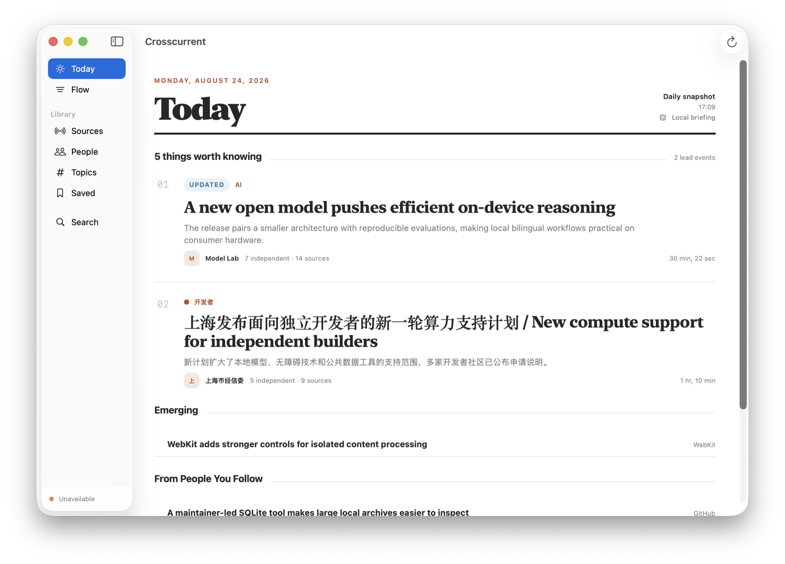
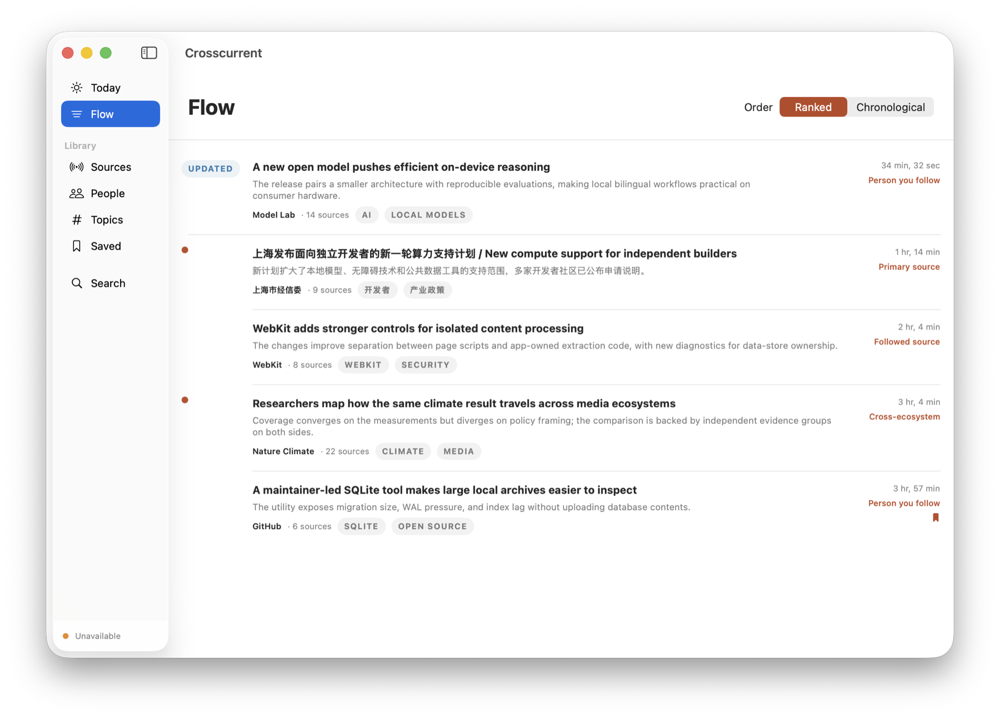
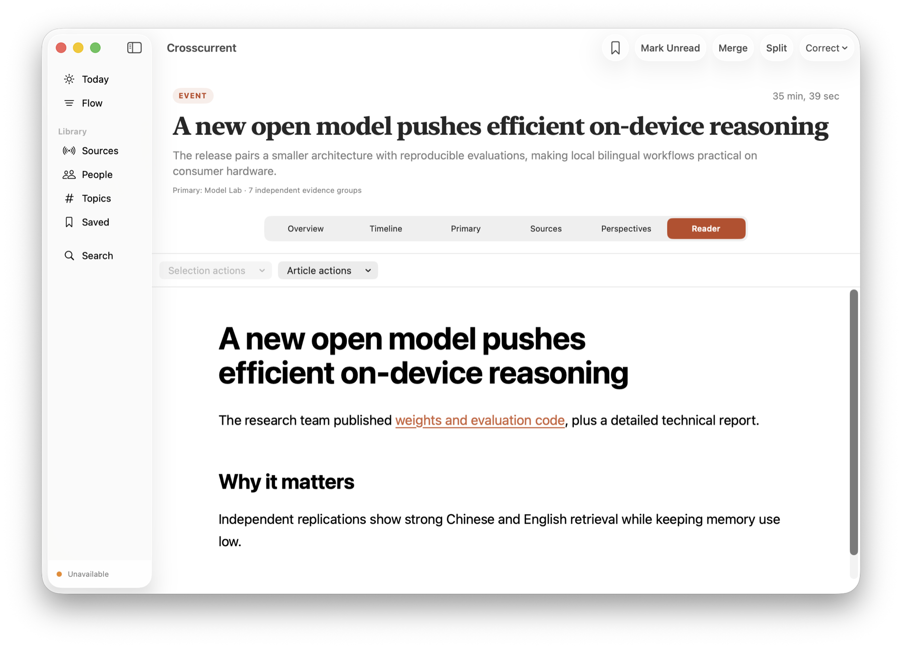
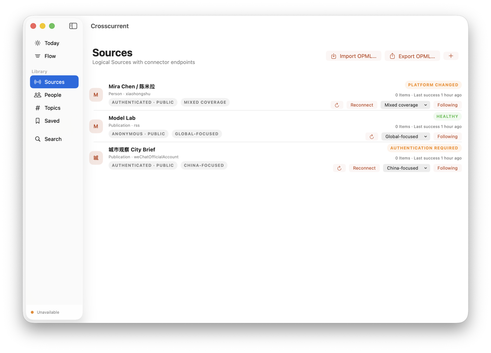

<div align="center">

# Crosscurrent

### Follow everything. Read what matters.

A personal intelligence feed for macOS that connects related coverage, quiets
repetition, and turns everything you follow into a briefing worth reading.

[What it does](#what-crosscurrent-does) · [Product tour](#see-the-whole-story) · [Build from source](#build-from-source)

</div>



## Information arrives as a flood. Stories do not.

Most feed readers ask you to work through a queue of individual posts. Crosscurrent
looks one level higher. It treats each item as evidence, connects related coverage
into an evolving Event, and ranks the developments that deserve your attention.

Follow broadly without reading the same story five times. Open Crosscurrent when
you want a calm view of what changed, why it matters, and where the information
came from.

## What Crosscurrent does

- **Builds a daily intelligence brief.** Today selects the strongest Events into a
  stable daily snapshot, with dedicated space for emerging developments, people
  you follow, and deeper reading.
- **Connects coverage into Events.** Related items become evidence for the same
  developing story. Source counts, independent coverage, perspectives, and
  revision history keep the synthesis inspectable.
- **Keeps the full stream close by.** Flow presents every Event in ranked or
  chronological order, with clear reasons for why something surfaced.
- **Reads like a native publication.** The built-in Reader preserves useful article
  structure—including headings, links, code, math, tables, figures, and
  captions—while removing executable content.
- **Organizes what you follow.** Add feeds, webpages, repositories, publications,
  and supported creator profiles; import or export an OPML library; then browse
  Sources, People, Topics, and Saved Events.
- **Searches the archive, not just headlines.** Search across current Items, Events,
  Sources, People, organizations, and Topics. Historical revisions remain an
  explicit opt-in.

Core reading, clustering, ranking, lexical search, and extractive summaries work
without an AI provider. Optional AI reading and synthesis actions can use a local
or configured cloud provider; cloud access is subject to explicit content-policy
and consent boundaries.

## See the whole story

### Rank the current, then follow the evidence

Flow keeps the complete stream available while explaining why each Event ranks.
Open one to move between its overview, timeline, primary source, supporting
sources, perspectives, and Reader.

| Ranked Flow | Native Reader |
| --- | --- |
|  |  |

### One library, different kinds of sources

Crosscurrent keeps source identity separate from the connector used to reach it.
That lets a library mix open feeds with supported authenticated sources while
showing access, privacy, coverage, and connection health clearly.



## How it works

```text
Sources → Items → Events → Topics & ranking → Today / Flow
```

Sources produce individual Items. Crosscurrent keeps those Items as evidence,
groups related information into Events, and uses the people and topics you follow
along with evidence quality to decide what belongs in Today. New reporting can
update an Event without rewriting what was known before.

## Build from source

Crosscurrent does not yet have a packaged public release. The current way to try it
is to build the app from source on an Apple silicon Mac running macOS 15 or later.

You will need Xcode 26 or newer. Clone the repository, open the checked-in project,
select the **Crosscurrent** scheme and **My Mac**, then run:

```sh
git clone https://github.com/qinchonghanzuibang/Crosscurrent.git
cd Crosscurrent
open Crosscurrent.xcodeproj
```

For a command-line build:

```sh
xcodebuild \
  -project Crosscurrent.xcodeproj \
  -scheme Crosscurrent \
  -configuration Debug \
  CODE_SIGNING_ALLOWED=NO \
  build
```

Unsigned Debug builds run the foreground app. Background refresh, authenticated
browser sessions, and Share Extension integration require an appropriately signed
build.

## Development

Crosscurrent is a native Swift 6 application built with SwiftUI and AppKit. The
Xcode project is checked in; install XcodeGen 2.46 or newer only when changing
`project.yml`, then regenerate it with `xcodegen generate`.

Run the package test suite with:

```sh
swift test --package-path Packages/CrosscurrentKit
```

## Acknowledgements

Crosscurrent draws inspiration from thoughtful feed readers and reading tools,
including NetNewsWire and PaperRss.

## License

Crosscurrent is available under the [MIT License](LICENSE). Copyright 2026 Chonghan
Qin.
